# Plugged.in Agent Protocol (PAP)

**Version**: 1.0 (Paper-Aligned)
**Status**: Stable Candidate
**Last Updated**: November 4, 2025

PAP is a comprehensive framework for autonomous agent lifecycle management, establishing Plugged.in as the central authority for creating, configuring, and controlling autonomous agents while enabling distributed operation through open protocols. The protocol addresses critical gaps in agent reliability, governance, and interoperability identified in production deployments.

**"Autonomy without anarchy"** - Agents operate independently yet remain under organizational governance through protocol-level controls.

## Architecture Overview

```mermaid
graph TB
    subgraph Station["🛰️ The Station (Plugged.in Core)"]
        Registry["Registry & Identity"]
        Policy["Policy Engine"]
        Memory["Memory Service"]
        Control["Control Center"]
    end

    subgraph Proxy["PAP Proxy (mcp.plugged.in)"]
        Auth["🔐 mTLS Auth"]
        Router["🔀 Message Router"]
        Logger["📊 Telemetry Logger"]
        RateLimit["⏱️ Rate Limiter"]
        Sig["✍️ Signature Verify"]
    end

    subgraph Shuttles["🚀 Autonomous Agents (Shuttles)"]
        Focus["Focus Agent<br/>focus.cluster.a.plugged.in"]
        MemAgent["Memory Agent<br/>memory.cluster.a.plugged.in"]
        Edge["Edge Agent<br/>edge.cluster.a.plugged.in"]
        Custom["Custom Agent<br/>custom.cluster.a.plugged.in"]
    end

    Station <-->|Commands<br/>Telemetry| Proxy
    Proxy <-->|invoke<br/>response<br/>event| Focus
    Proxy <-->|invoke<br/>response<br/>event| MemAgent
    Proxy <-->|invoke<br/>response<br/>event| Edge
    Proxy <-->|invoke<br/>response<br/>event| Custom

    Focus -.->|heartbeat| Proxy
    MemAgent -.->|heartbeat| Proxy
    Edge -.->|heartbeat| Proxy
    Custom -.->|heartbeat| Proxy

    Control -.->|🔴 KILL| Proxy

    style Station fill:#1e3a8a,stroke:#3b82f6,color:#fff
    style Proxy fill:#064e3b,stroke:#10b981,color:#fff
    style Shuttles fill:#581c87,stroke:#a855f7,color:#fff
    style Control fill:#7f1d1d,stroke:#ef4444,color:#fff
```



## Dual-Profile Architecture

PAP v1.0 introduces two complementary profiles for control and data operations:

### PAP-CP (Control Plane)
- **Transport**: gRPC/HTTP/2 with TLS 1.3 + mTLS
- **Wire Format**: Protocol Buffers v3
- **Security**: Ed25519 signatures, nonce-based replay protection
- **Use Cases**: Provisioning, lifecycle control, heartbeats, metrics, termination

### PAP-Hooks (Open I/O)
- **Transport**: JSON-RPC 2.0 over WebSocket/SSE
- **Wire Format**: UTF-8 JSON
- **Security**: OAuth 2.1 with JWT
- **Use Cases**: Tool invocations, MCP access, A2A delegation, external APIs

**Gateway Translation**: Gateways MAY translate between profiles for ecosystem interoperability.

## Key Innovations

### 1. Zombie-Prevention Superpower
**Strict heartbeat/metrics separation** prevents control plane saturation:
- **Heartbeats**: Liveness-only (mode, uptime). NO resource data.
- **Metrics**: Separate channel for CPU, memory, custom gauges.
- **Detection**: One missed interval → AGENT_UNHEALTHY (480)

### 2. Normative Lifecycle States
```
NEW → PROVISIONED → ACTIVE ↔ DRAINING → TERMINATED
                        ↓ (error)
                      KILLED
```
Station holds exclusive kill authority.

### 3. Protocol Interoperability
- **MCP**: Native tool access via PAP-Hooks
- **A2A**: Peer delegation and discovery
- **Frameworks**: LangChain, CrewAI can adopt PAP for lifecycle management

### 4. Comprehensive Security
- Mutual TLS for PAP-CP
- Ed25519 signatures on all control messages
- OAuth 2.1 for PAP-Hooks
- Automatic credential rotation (90 days)
- Immutable audit trails

## Message Flow

```mermaid
sequenceDiagram
    participant Core as 🛰️ Station Core
    participant Proxy as PAP Proxy
    participant Agent as 🚀 Agent (Shuttle)

    Note over Core,Agent: Provisioning Phase
    Core->>Agent: Invite Token (JWT)
    Agent->>Proxy: Authenticate + Register
    Proxy->>Core: Validate Identity
    Core->>Agent: Certificate + DNS ID

    Note over Core,Agent: Operation Phase
    loop Heartbeat (every 30s)
        Agent-->>Proxy: HeartbeatEvent (mode, uptime)
        Proxy-->>Core: Log Telemetry
    end

    Core->>Proxy: invoke Command
    Proxy->>Agent: invoke (signed)
    Agent->>Agent: Execute Task
    Agent->>Proxy: response (result)
    Proxy->>Core: response

    Agent->>Proxy: event (metrics, logs)
    Proxy->>Core: Store in Memory Service

    Note over Core,Agent: Zombie Detection
    Agent--xProxy: ❌ Heartbeat Missed
    Proxy->>Core: 🚨 AGENT_UNHEALTHY
    Core->>Proxy: terminate Command
    Proxy->>Agent: Graceful Shutdown

    Note over Core,Agent: Emergency Kill
    Core->>Proxy: 🔴 force_kill
    Proxy->>Agent: -9 Immediate Termination
```



## Repository Map

### Documentation (`docs/`)
- **`overview.md`**: Mission, vision, dual-profile architecture, and protocol innovations
- **`rfc/pap-rfc-001-v1.0.md`**: Complete PAP v1.0 specification (paper-aligned)
- **`pap-hooks-spec.md`**: JSON-RPC 2.0 open I/O profile specification
- **`service-registry.md`**: DNS-based agent discovery and capability advertisement
- **`ownership-transfer.md`**: Agent migration protocol between Stations
- **`deployment-guide.md`**: Kubernetes/Traefik reference deployment

### Protocol Definitions (`proto/`)
- **`pap/v1/pap.proto`**: Protocol Buffers v3 schema with lifecycle messages
  - PAP-CP messages: Provision, Invoke, Heartbeat, Metrics, Terminate, Transfer
  - Strict heartbeat/metrics separation
  - Lifecycle state definitions

### SDKs (`sdk/`)
- **TypeScript**: (Planned) PAP-CP and PAP-Hooks client libraries
- **Python**: (Planned) PAP-CP and PAP-Hooks client libraries
- **Rust**: (Planned) High-performance client libraries
- **Go**: (Planned) Cloud-native client libraries

### Services
- **`proxy/`**: Gateway with PAP-CP ↔ PAP-Hooks translation
- **`registry/`**: Service Registry for agent discovery
- **`ops/`**: Operational runbooks and monitoring

## Heartbeat vs. Metrics (Zombie Prevention)

**CRITICAL**: PAP v1.0 enforces strict separation between heartbeats and metrics.

### Heartbeat (Liveness Only)
- **Purpose**: Zombie detection
- **Payload**: Mode (EMERGENCY/IDLE/SLEEP), uptime_seconds
- **Forbidden**: CPU, memory, or any resource data
- **Intervals**:
  - EMERGENCY: 5 seconds
  - IDLE: 30 seconds (default)
  - SLEEP: 15 minutes
- **Detection**: One missed interval → AGENT_UNHEALTHY (480)

### Metrics (Resource Telemetry)
- **Purpose**: Monitoring and observability
- **Payload**: cpu_percent, memory_mb, requests_handled, custom_metrics
- **Channel**: Separate from heartbeats
- **Frequency**: Independent (typically 60s)

**Why This Matters**: Large telemetry payloads cannot starve the control path. This separation is PAP's "zombie-prevention superpower."

## DNS Topology

- Base zone: `plugged.in`
- Proxy edge: `mcp.plugged.in` (TLS termination, routing, rate limits)
- Agent namespace: `{agent}.{cluster}.a.plugged.in` (delegated `a.plugged.in` subzone)
- Delegation model:
  - `mcp.plugged.in` → Station-owned LB/frontdoor
  - `a.plugged.in` → Cluster-level DNS, aligned with certificate SANs and DNSSEC

## Error Codes (Summary)

| Enum | HTTP | Description |
|------|------|-------------|
| `OK` | 200 | Request completed successfully. |
| `ACCEPTED` | 202 | Task accepted; processing async. |
| `BAD_REQUEST` | 400 | Invalid message or arguments. |
| `UNAUTHORIZED` | 401 | Invalid or missing credentials. |
| `FORBIDDEN` | 403 | Action not permitted. |
| `NOT_FOUND` | 404 | Target agent/action not found. |
| `TIMEOUT` | 408 | Job or agent timeout. |
| `CONFLICT` | 409 | Version or concurrency conflict. |
| `RATE_LIMITED` | 429 | Too many requests. |
| `AGENT_UNHEALTHY` | 480 | Heartbeat anomaly detected. |
| `AGENT_BUSY` | 481 | Agent overloaded; retry later. |
| `DEPENDENCY_FAILED` | 482 | Downstream call failed. |
| `INTERNAL_ERROR` | 500 | Agent internal fault. |
| `PROXY_ERROR` | 502 | Routing/connection issue. |
| `VERSION_UNSUPPORTED` | 505 | Protocol version mismatch. |

## Message Types

PAP defines four canonical message families for all communication:


## Getting Started

### 1. Understand the Protocol
- Read `docs/overview.md` for mission, vision, and key innovations
- Study `docs/rfc/pap-rfc-001-v1.0.md` for complete v1.0 specification
- Review `docs/pap-hooks-spec.md` for open I/O profile

### 2. Explore the Wire Protocol
- Examine `proto/pap/v1/pap.proto` for Protocol Buffers definitions
- Understand dual-profile message structures
- Review lifecycle state transitions

### 3. Deploy a Reference Agent
- Follow `docs/deployment-guide.md` for Kubernetes deployment
- Configure DNS delegation and wildcard certificates
- Set up observability (Prometheus, Grafana)

### 4. Build an SDK Client (Coming Soon)
- Generate protobuf stubs: `protoc --proto_path=. --go_out=sdk/go proto/pap/v1/pap.proto`
- Implement PAP-CP client with mTLS and Ed25519 signing
- Implement PAP-Hooks client with OAuth 2.1 and WebSocket

## Observability & Tracing

- **OpenTelemetry**: All messages carry `trace_id` and `span_id` for distributed tracing
- **Metrics**: Prometheus-format metrics for heartbeats, requests, errors, and circuit breakers
- **Logging**: Structured JSON logs with trace context
- **Audit Trail**: Immutable, append-only logs for all lifecycle events

## Status and Roadmap

### ✅ Completed (v1.0)
- Dual-profile architecture (PAP-CP + PAP-Hooks)
- Protocol Buffer schema with lifecycle messages
- Strict heartbeat/metrics separation
- Comprehensive specifications and documentation
- Deployment reference (Kubernetes/Traefik)

### 🔄 In Progress
- SDK implementations (TypeScript, Python, Rust, Go)
- Gateway with protocol translation
- Station with provisioning and lifecycle management
- Conformance test suite

### 📋 Planned (v1.1+)
- Multi-region active-active deployment
- Federated identity with DIDs
- Formal verification (TLA+)
- Advanced policy DSL

See `CHANGELOG.md` for detailed version history.

## Contributing
Please open issues or drafts for changes to specs, schemas, or operational playbooks. Align proposal discussions with the RFC structure documented under `docs/rfc/`.

See `CODE_OF_CONDUCT.md` and `SECURITY.md` for governance and vulnerability reporting.

## License
PAP is released under the Apache 2.0 License. See `LICENSE` for the full text and patent grant.
