# Plugged.in Agent Protocol (PAP)

PAP is the control and telemetry backbone that connects Plugged.in's core control plane (the Station) with autonomous agents (the Satellites). The protocol defines how agents authenticate, exchange commands, stream telemetry, negotiate lifecycle events, and remain accountable to centralized policy without losing their autonomy.

## Architecture Overview

## Message Flow

```mermaid
sequenceDiagram
    participant Core as 🛰️ Station Core
    participant Proxy as PAP Proxy
    participant Agent as 🚀 Agent (Shuttle)

    Note over Core,Agent: Provisioning Phase
    Core->>Agent: Invite Token (JWT)
    Agent->>Proxy: Authenticate + Register
    Proxy->>Core: Validate Identity
    Core->>Agent: Certificate + DNS ID

    Note over Core,Agent: Operation Phase
    loop Heartbeat (every 30s)
        Agent-->>Proxy: HeartbeatEvent (mode, uptime)
        Proxy-->>Core: Log Telemetry
    end

    Core->>Proxy: invoke Command
    Proxy->>Agent: invoke (signed)
    Agent->>Agent: Execute Task
    Agent->>Proxy: response (result)
    Proxy->>Core: response

    Agent->>Proxy: event (metrics, logs)
    Proxy->>Core: Store in Memory Service

    Note over Core,Agent: Zombie Detection
    Agent--xProxy: ❌ Heartbeat Missed
    Proxy->>Core: 🚨 AGENT_UNHEALTHY
    Core->>Proxy: terminate Command
    Proxy->>Agent: Graceful Shutdown

    Note over Core,Agent: Emergency Kill
    Core->>Proxy: 🔴 force_kill
    Proxy->>Agent: -9 Immediate Termination
```

## Repository Map

- `docs/`: Human-readable specifications and architectural notes.
  - `overview.md`: Narrative overview of the mission, vision, and why PAP exists.
  - `rfc/pap-rfc-001.md`: Draft transport specification (handshake, message schema, lifecycle flows).
- `proto/`: Protocol Buffers definitions and related guidance.
  - `pap/v1/pap.proto`: Initial wire schema for v1 messages.
  - `README.md`: Instructions for working with protobuf tooling.
- `sdk/`: Language-specific SDK plans and future implementations.
  - `README.md`: Current goals, parity guidelines, and open tasks.
- `proxy/`: PAP proxy and network edge notes.
- `registry/`: Identity, policy, and capability management plans.
- `ops/`: Operational runbooks, heartbeat thresholds, and SLO tracking.

## Message Types

PAP defines four canonical message families for all communication:

## Getting Started

1. Read `docs/overview.md` to understand the protocol vision.
2. Dive into `docs/rfc/pap-rfc-001.md` for transport-level requirements.
3. Generate language stubs from `proto/pap/v1/pap.proto` once SDK work begins.

## Status
This repository contains the initial scaffolding for PAP v1.0. Specifications are in draft form and subject to change as infrastructure and SDK work progress.

## Contributing
Please open issues or drafts for changes to specs, schemas, or operational playbooks. Align proposal discussions with the RFC structure documented under `docs/rfc/`.

## License
PAP is released under the Apache 2.0 License. See `LICENSE` for the full text and patent grant.
