# Plugged.in Agent Protocol (PAP)

[](https://github.com/VeriTeknik/PAP/releases)
[-red.svg)](https://github.com/VeriTeknik/PAP/blob/main/docs/rfc/pap-rfc-001-v1.0.md)
[](https://github.com/VeriTeknik/PAP)
[](LICENSE)
[](docs/rfc/pap-rfc-001-v1.0.md)

**Protocol Version**: 1.0 (Paper-Aligned) | **Paper Version**: Draft v0.3 (for arXiv cs.DC) | **Status**: Stable Candidate | **Last Updated**: November 12, 2025

PAP is a comprehensive framework for autonomous agent lifecycle management, establishing Plugged.in as the central authority for creating, configuring, and controlling autonomous agents while enabling distributed operation through open protocols. The protocol addresses critical gaps in agent reliability, governance, and interoperability identified in production deployments and academic research.

> **"Autonomy without anarchy"** - Agents operate independently yet remain under organizational governance through protocol-level controls.

---

## Table of Contents

- [Why PAP?](#why-pap)
- [Features at a Glance](#features-at-a-glance)
- [Architecture Overview](#architecture-overview)
- [Dual-Profile Architecture](#dual-profile-architecture)
- [Key Innovations](#key-innovations)
- [Protocol Comparison](#protocol-comparison)
- [Quick Examples](#quick-examples)
- [Repository Map](#repository-map)
- [Getting Started](#getting-started)
- [Status and Roadmap](#status-and-roadmap)
- [Contributing](#contributing)

---

## Why PAP?

Unlike MCP, ACP, and A2A which focus on **tool invocation and orchestration logic**, PAP defines the **physical and logical substrate** - how agents live, breathe, migrate, and die across infrastructure. It merges operational DevOps controls with cognitive AI design.

### The Problem

Recent surveys show significant gaps in autonomous agent reliability:
- **Silent failures ("zombies")**: Agents that appear alive but are unresponsive
- **Uncontrolled loops**: Agents stuck in infinite reasoning cycles
- **Tool fragility**: No standardized error handling or circuit breakers
- **Governance gaps**: No audit trails, ownership transfer, or kill authority
- **Protocol fragmentation**: Incompatible approaches to agent communication

### The Solution

PAP provides **protocol-level guarantees** for:
1. **Operational Reliability**: Zombie prevention via heartbeat/metrics separation
2. **Governance**: Audit trails, policy enforcement, Station authority
3. **Interoperability**: Native support for MCP tools and A2A peer communication
4. **Production-Ready**: Security, observability, and deployment patterns from day one

### Based on Academic Research

PAP v1.0 is based on the academic paper **"The Plugged.in Agent Protocol (PAP): A Comprehensive Framework for Autonomous Agent Lifecycle Management"** (Draft v0.3 for arXiv cs.DC) by Cem Karaca. The protocol addresses failure modes identified in:

- **Perception-reasoning-memory-action frameworks** [1] - Recent surveys document gaps between human performance and state-of-the-art agents (OSWorld: humans >72% vs. models ~43%)
- **Multi-agent coordination** [4,7] - Systematic failures in cascading errors when agents lack proper lifecycle management
- **Agent security** [5,6] - Threat models and security requirements for autonomous agents
- **Protocol interoperability** [2,3,9] - Integration with MCP, A2A, and existing frameworks

**Key Research Contributions:**
1. First comprehensive framework combining control plane authority with distributed agent autonomy
2. Strict heartbeat/telemetry separation preventing self-DoS under load
3. Normative lifecycle states with formal transition semantics
4. Dual-profile architecture enabling both ops-grade control and open ecosystem integration

See `docs/rfc/pap-rfc-001-v1.0.md` for complete specification and full academic references.

---

## Features at a Glance

| Feature | Description |
|---------|-------------|
| 🔄 **Dual Profiles** | PAP-CP (gRPC/mTLS) for control, PAP-Hooks (JSON-RPC/OAuth) for I/O |
| 🧟 **Zombie Prevention** | Strict heartbeat/metrics separation - the superpower |
| 🔄 **Lifecycle Management** | Normative states: NEW → PROVISIONED → ACTIVE → TERMINATED |
| 🔐 **Security** | mTLS, Ed25519 signatures, OAuth 2.1, credential rotation |
| 🌐 **DNS-Based Identity** | `{agent}.{region}.a.plugged.in` with DNSSEC |
| 📊 **Observability** | OpenTelemetry traces, Prometheus metrics, structured logs |
| 🔄 **Ownership Transfer** | Migrate agents between Stations with state preservation |
| 🔌 **MCP Compatible** | Native tool access via PAP-Hooks |
| 🤝 **A2A Compatible** | Peer delegation and discovery |
| ☸️ **Cloud-Native** | Kubernetes/Traefik deployment reference |

---

## Architecture Overview

```mermaid
graph TB
    subgraph Station["🛰️ The Station (Plugged.in Core)"]
        Registry["Registry & Identity"]
        Policy["Policy Engine"]
        Memory["Memory Service"]
        Control["Control Center"]
    end

    subgraph Proxy["PAP Proxy (mcp.plugged.in)"]
        Auth["🔐 mTLS Auth"]
        Router["🔀 Message Router"]
        Logger["📊 Telemetry Logger"]
        RateLimit["⏱️ Rate Limiter"]
        Sig["✍️ Signature Verify"]
    end

    subgraph Shuttles["🚀 Autonomous Agents (Shuttles)"]
        Focus["Focus Agent<br/>focus.cluster.a.plugged.in"]
        MemAgent["Memory Agent<br/>memory.cluster.a.plugged.in"]
        Edge["Edge Agent<br/>edge.cluster.a.plugged.in"]
        Custom["Custom Agent<br/>custom.cluster.a.plugged.in"]
    end

    Station <-->|Commands<br/>Telemetry| Proxy
    Proxy <-->|invoke<br/>response<br/>event| Focus
    Proxy <-->|invoke<br/>response<br/>event| MemAgent
    Proxy <-->|invoke<br/>response<br/>event| Edge
    Proxy <-->|invoke<br/>response<br/>event| Custom

    Focus -.->|heartbeat| Proxy
    MemAgent -.->|heartbeat| Proxy
    Edge -.->|heartbeat| Proxy
    Custom -.->|heartbeat| Proxy

    Control -.->|🔴 KILL| Proxy

    style Station fill:#1e3a8a,stroke:#3b82f6,color:#fff
    style Proxy fill:#064e3b,stroke:#10b981,color:#fff
    style Shuttles fill:#581c87,stroke:#a855f7,color:#fff
    style Control fill:#7f1d1d,stroke:#ef4444,color:#fff
```



## Dual-Profile Architecture

PAP v1.0 introduces two complementary profiles for control and data operations:

### PAP-CP (Control Plane)
- **Transport**: gRPC/HTTP/2 with TLS 1.3 + mTLS
- **Wire Format**: Protocol Buffers v3
- **Security**: Ed25519 signatures, nonce-based replay protection
- **Use Cases**: Provisioning, lifecycle control, heartbeats, metrics, termination

### PAP-Hooks (Open I/O)
- **Transport**: JSON-RPC 2.0 over WebSocket/SSE
- **Wire Format**: UTF-8 JSON
- **Security**: OAuth 2.1 with JWT
- **Use Cases**: Tool invocations, MCP access, A2A delegation, external APIs

**Gateway Translation**: Gateways MAY translate between profiles for ecosystem interoperability.

## Key Innovations

### 1. Zombie-Prevention Superpower
**Strict heartbeat/metrics separation** prevents control plane saturation:
- **Heartbeats**: Liveness-only (mode, uptime). NO resource data.
- **Metrics**: Separate channel for CPU, memory, custom gauges.
- **Detection**: One missed interval → AGENT_UNHEALTHY (480)

### 2. Normative Lifecycle States
```
NEW → PROVISIONED → ACTIVE ↔ DRAINING → TERMINATED
                        ↓ (error)
                      KILLED
```
Station holds exclusive kill authority.

### 3. Protocol Interoperability
- **MCP**: Native tool access via PAP-Hooks
- **A2A**: Peer delegation and discovery
- **Frameworks**: LangChain, CrewAI can adopt PAP for lifecycle management

### 4. Comprehensive Security
- Mutual TLS for PAP-CP
- Ed25519 signatures on all control messages
- OAuth 2.1 for PAP-Hooks
- Automatic credential rotation (90 days)
- Immutable audit trails

---

## Protocol Comparison

| Aspect | PAP | MCP | A2A | Traditional Orchestration |
|--------|-----|-----|-----|--------------------------|
| **Focus** | Agent lifecycle & substrate | Tool invocation | Peer delegation | Workflow coordination |
| **Zombie Prevention** | ✅ Built-in (heartbeat separation) | ❌ Not addressed | ❌ Not addressed | ⚠️ Application-level |
| **Lifecycle States** | ✅ Normative (6 states) | ❌ Not specified | ⚠️ Task-level only | ⚠️ Framework-specific |
| **Kill Authority** | ✅ Station-controlled | ❌ Not specified | ❌ Not specified | ⚠️ Manual intervention |
| **Ownership Transfer** | ✅ Protocol-level | ❌ Not supported | ❌ Not supported | ❌ Not supported |
| **Audit Trail** | ✅ Immutable logs | ⚠️ Implementation-dependent | ⚠️ Implementation-dependent | ⚠️ Framework-specific |
| **Tool Access** | ✅ Via PAP-Hooks (MCP-compatible) | ✅ Native | ⚠️ Integration required | ⚠️ Framework-specific |
| **Peer Communication** | ✅ Via PAP-Hooks (A2A-compatible) | ⚠️ Not native | ✅ Native | ⚠️ Framework-specific |
| **Security Model** | ✅ mTLS + Ed25519 + OAuth 2.1 | ⚠️ Implementation-dependent | ⚠️ Implementation-dependent | ⚠️ Framework-specific |
| **DNS-Based Identity** | ✅ Native with DNSSEC | ❌ Not specified | ❌ Not specified | ❌ Not specified |
| **Multi-Region** | ✅ Planned (v1.1) | ⚠️ Implementation-dependent | ❌ Not specified | ⚠️ Framework-specific |

**Key Insight**: PAP is **complementary** to MCP and A2A, not competitive. Agents use PAP for lifecycle management while leveraging MCP for tools and A2A for peer communication.

---

## Quick Examples

### Heartbeat Message (PAP-CP)

**Liveness-Only - No Resource Data!**

```protobuf
message HeartbeatEvent {
  Header header = 1;                   // trace_id, nonce, timestamp
  HeartbeatMode mode = 2;              // EMERGENCY, IDLE, or SLEEP
  uint64 uptime_seconds = 3;           // 259200 (3 days)
  // FORBIDDEN: cpu_percent, memory_mb
}
```

**Example (Protocol Buffers binary over gRPC):**
```
header {
  version: "pap-cp/1.0"
  agent_uuid: "pluggedin/research@1.2.0"
  station_id: "plugged.in"
  instance_id: "inst-abc123"
  timestamp: 1699000000
  nonce: [32 random bytes]
  trace_id: "trace-xyz"
}
mode: IDLE
uptime_seconds: 259200
signature: [Ed25519 signature]
checksum: [SHA-256 hash]
```

### Metrics Report (Separate Channel)

```protobuf
message MetricsReport {
  Header header = 1;
  float cpu_percent = 2;               // 45.2
  uint64 memory_mb = 3;                // 512
  uint64 requests_handled = 4;         // 1543
  map<string, double> custom_metrics = 5;
}
```

### Tool Invocation (PAP-Hooks)

**JSON-RPC 2.0 over WebSocket:**

```json
{
  "jsonrpc": "2.0",
  "id": "req-12345",
  "method": "tool.invoke",
  "params": {
    "tool": "web-search",
    "arguments": {
      "query": "quantum computing",
      "limit": 10
    },
    "context": {
      "agent_uuid": "pluggedin/research@1.2.0",
      "trace_id": "trace-xyz",
      "authorization": "Bearer eyJhbGc..."
    }
  }
}
```

**Response:**

```json
{
  "jsonrpc": "2.0",
  "id": "req-12345",
  "result": {
    "status": "success",
    "data": {
      "results": [
        {
          "title": "Quantum Computing Basics",
          "url": "https://example.com/quantum"
        }
      ]
    },
    "metadata": {
      "duration_ms": 120,
      "cost": 0.001
    }
  }
}
```

### Ownership Transfer

```protobuf
// Step 1: Initiate transfer
TransferInit {
  agent_uuid: "pluggedin/research@1.2.0"
  target_station: "station-b.example.com"
  preserve_state: true
  initiated_at: 2025-11-04T12:34:56Z
}

// Step 2: Accept with new credentials
TransferAccept {
  agent_uuid: "pluggedin/research@1.2.0"
  new_credentials: {
    tls_cert: "-----BEGIN CERTIFICATE-----..."
    signing_key_ref: "vault://keys/agent-new"
  }
  transfer_token: "token-xyz"
}

// Step 3: Complete transfer
TransferComplete {
  agent_uuid: "pluggedin/research@1.2.0"
  old_station: "plugged.in"
  new_station: "station-b.example.com"
  keys_rotated: true
  completed_at: 2025-11-04T12:36:56Z
}
```

---

## Message Flow

```mermaid
sequenceDiagram
    participant Core as 🛰️ Station Core
    participant Proxy as PAP Proxy
    participant Agent as 🚀 Agent (Shuttle)

    Note over Core,Agent: Provisioning Phase
    Core->>Agent: Invite Token (JWT)
    Agent->>Proxy: Authenticate + Register
    Proxy->>Core: Validate Identity
    Core->>Agent: Certificate + DNS ID

    Note over Core,Agent: Operation Phase
    loop Heartbeat (every 30s)
        Agent-->>Proxy: HeartbeatEvent (mode, uptime)
        Proxy-->>Core: Log Telemetry
    end

    Core->>Proxy: invoke Command
    Proxy->>Agent: invoke (signed)
    Agent->>Agent: Execute Task
    Agent->>Proxy: response (result)
    Proxy->>Core: response

    Agent->>Proxy: event (metrics, logs)
    Proxy->>Core: Store in Memory Service

    Note over Core,Agent: Zombie Detection
    Agent--xProxy: ❌ Heartbeat Missed
    Proxy->>Core: 🚨 AGENT_UNHEALTHY
    Core->>Proxy: terminate Command
    Proxy->>Agent: Graceful Shutdown

    Note over Core,Agent: Emergency Kill
    Core->>Proxy: 🔴 force_kill
    Proxy->>Agent: -9 Immediate Termination
```



## Repository Map

### Documentation (`docs/`)
- **`overview.md`**: Mission, vision, dual-profile architecture, and protocol innovations
- **`rfc/pap-rfc-001-v1.0.md`**: Complete PAP v1.0 specification (paper-aligned)
- **`pap-hooks-spec.md`**: JSON-RPC 2.0 open I/O profile specification
- **`service-registry.md`**: DNS-based agent discovery and capability advertisement
- **`ownership-transfer.md`**: Agent migration protocol between Stations
- **`deployment-guide.md`**: Kubernetes/Traefik reference deployment

### Protocol Definitions (`proto/`)
- **`pap/v1/pap.proto`**: Protocol Buffers v3 schema with lifecycle messages
  - PAP-CP messages: Provision, Invoke, Heartbeat, Metrics, Terminate, Transfer
  - Strict heartbeat/metrics separation
  - Lifecycle state definitions

### SDKs (`sdk/`)
- **TypeScript**: (Planned) PAP-CP and PAP-Hooks client libraries
- **Python**: (Planned) PAP-CP and PAP-Hooks client libraries
- **Rust**: (Planned) High-performance client libraries
- **Go**: (Planned) Cloud-native client libraries

### Services
- **`proxy/`**: Gateway with PAP-CP ↔ PAP-Hooks translation
- **`registry/`**: Service Registry for agent discovery
- **`ops/`**: Operational runbooks and monitoring

## Heartbeat vs. Metrics (Zombie Prevention)

**CRITICAL**: PAP v1.0 enforces strict separation between heartbeats and metrics.

### Heartbeat (Liveness Only)
- **Purpose**: Zombie detection
- **Payload**: Mode (EMERGENCY/IDLE/SLEEP), uptime_seconds
- **Forbidden**: CPU, memory, or any resource data
- **Intervals**:
  - EMERGENCY: 5 seconds
  - IDLE: 30 seconds (default)
  - SLEEP: 15 minutes
- **Detection**: One missed interval → AGENT_UNHEALTHY (480)

### Metrics (Resource Telemetry)
- **Purpose**: Monitoring and observability
- **Payload**: cpu_percent, memory_mb, requests_handled, custom_metrics
- **Channel**: Separate from heartbeats
- **Frequency**: Independent (typically 60s)

**Why This Matters**: Large telemetry payloads cannot starve the control path. This separation is PAP's "zombie-prevention superpower."

## DNS Topology

- Base zone: `plugged.in`
- Proxy edge: `mcp.plugged.in` (TLS termination, routing, rate limits)
- Agent namespace: `{agent}.{cluster}.a.plugged.in` (delegated `a.plugged.in` subzone)
- Delegation model:
  - `mcp.plugged.in` → Station-owned LB/frontdoor
  - `a.plugged.in` → Cluster-level DNS, aligned with certificate SANs and DNSSEC

## Error Codes (Summary)

| Enum | HTTP | Description |
|------|------|-------------|
| `OK` | 200 | Request completed successfully. |
| `ACCEPTED` | 202 | Task accepted; processing async. |
| `BAD_REQUEST` | 400 | Invalid message or arguments. |
| `UNAUTHORIZED` | 401 | Invalid or missing credentials. |
| `FORBIDDEN` | 403 | Action not permitted. |
| `NOT_FOUND` | 404 | Target agent/action not found. |
| `TIMEOUT` | 408 | Job or agent timeout. |
| `CONFLICT` | 409 | Version or concurrency conflict. |
| `RATE_LIMITED` | 429 | Too many requests. |
| `AGENT_UNHEALTHY` | 480 | Heartbeat anomaly detected. |
| `AGENT_BUSY` | 481 | Agent overloaded; retry later. |
| `DEPENDENCY_FAILED` | 482 | Downstream call failed. |
| `INTERNAL_ERROR` | 500 | Agent internal fault. |
| `PROXY_ERROR` | 502 | Routing/connection issue. |
| `VERSION_UNSUPPORTED` | 505 | Protocol version mismatch. |

## Message Types

PAP defines four canonical message families for all communication:


## Getting Started

### 1. Understand the Protocol
- Read `docs/overview.md` for mission, vision, and key innovations
- Study `docs/rfc/pap-rfc-001-v1.0.md` for complete v1.0 specification
- Review `docs/pap-hooks-spec.md` for open I/O profile

### 2. Explore the Wire Protocol
- Examine `proto/pap/v1/pap.proto` for Protocol Buffers definitions
- Understand dual-profile message structures
- Review lifecycle state transitions

### 3. Deploy a Reference Agent
- Follow `docs/deployment-guide.md` for Kubernetes deployment
- Configure DNS delegation and wildcard certificates
- Set up observability (Prometheus, Grafana)

### 4. Build an SDK Client (Coming Soon)
- Generate protobuf stubs: `protoc --proto_path=. --go_out=sdk/go proto/pap/v1/pap.proto`
- Implement PAP-CP client with mTLS and Ed25519 signing
- Implement PAP-Hooks client with OAuth 2.1 and WebSocket

## Observability & Tracing

- **OpenTelemetry**: All messages carry `trace_id` and `span_id` for distributed tracing
- **Metrics**: Prometheus-format metrics for heartbeats, requests, errors, and circuit breakers
- **Logging**: Structured JSON logs with trace context
- **Audit Trail**: Immutable, append-only logs for all lifecycle events

## Status and Roadmap

### ✅ Completed (v1.0)
- Dual-profile architecture (PAP-CP + PAP-Hooks)
- Protocol Buffer schema with lifecycle messages
- Strict heartbeat/metrics separation
- Comprehensive specifications and documentation
- Deployment reference (Kubernetes/Traefik)
- Academic paper (Draft v0.3 for arXiv cs.DC)

### 🔄 In Progress
- SDK implementations (TypeScript, Python, Rust, Go)
- Gateway with protocol translation
- Station with provisioning and lifecycle management
- Conformance test suite

### 📋 Planned (v1.1+)
- Multi-region active-active deployment
- Federated identity with DIDs
- Formal verification (TLA+)
- Advanced policy DSL
- Performance evaluation and benchmarking

### 🎯 Evaluation Targets
Based on the academic paper, PAP v1.0 is designed to achieve:

**E1: Control Plane Latency**
- Heartbeat round-trip: P50 <5ms, P99 <20ms
- Control message processing: P50 <10ms, P99 <50ms
- Measured under 1000 agent load

**E2: Liveness Detection**
- False positive rate: <0.1%
- Detection latency: Within 1.5× configured interval
- Recovery time from UNHEALTHY: <10 seconds

**E3: Throughput**
- Single gateway: 10,000+ requests/second
- Horizontal scaling: Linear to 100,000+ requests/second
- Circuit breaker activation: <100ms after threshold

**E4: Ownership Transfer**
- Transfer duration: <30 seconds including state snapshot
- Credential rotation: Atomic with zero downtime
- Post-transfer error rate: <0.01%

See `CHANGELOG.md` for detailed version history.

## Contributing

We welcome contributions! Here's how you can help:

### Reporting Issues
- **Bug Reports**: Use GitHub Issues with the `bug` label
- **Feature Requests**: Use GitHub Issues with the `enhancement` label
- **Security Issues**: Follow `SECURITY.md` guidelines (private disclosure)

### Contributing Code
1. Fork the repository
2. Create a feature branch: `git checkout -b feature/amazing-feature`
3. Make your changes following the coding standards
4. Write tests and documentation
5. Submit a pull request

### RFC Process
For protocol changes or new features:
1. Create an RFC document in `docs/rfc/`
2. Follow the template from existing RFCs
3. Open a discussion issue
4. Iterate based on community feedback
5. Submit PR when consensus is reached

See `CODE_OF_CONDUCT.md` for community guidelines.

---

## Community and Resources

### Documentation
- 📖 [Complete Specification](docs/rfc/pap-rfc-001-v1.0.md) - PAP v1.0 full spec
- 🔌 [PAP-Hooks Spec](docs/pap-hooks-spec.md) - JSON-RPC 2.0 profile
- 🌐 [Service Registry](docs/service-registry.md) - DNS-based discovery
- 🔄 [Ownership Transfer](docs/ownership-transfer.md) - Agent migration
- ☸️ [Deployment Guide](docs/deployment-guide.md) - Kubernetes reference

### Academic References
PAP v1.0 is based on research addressing autonomous agent failure modes:

[1] V. de Lamo Castrillo, H. K. Gidey, A. Lenz, and A. Knoll, "Fundamentals of Building Autonomous LLM Agents," arXiv:2510.09244, 2025.

[2] Anthropic, "Model Context Protocol Specification," Available: https://modelcontextprotocol.io/specification/2025-06-18/, 2025.

[3] Linux Foundation, "Agent-to-Agent Protocol (A2A) Specification v0.3," Available: https://a2a-protocol.org/latest/specification/, 2025.

[4] H. Tran, et al., "Multi-Agent Collaboration Mechanisms: A Survey of LLMs," arXiv:2501.06322, 2025.

[5] Y. He, et al., "Security of AI Agents," arXiv:2406.08689v2, 2024.

[6] Y. Ding, et al., "Multi-Agent Coordination via Multi-Level Communication," Proceedings of NeurIPS 2024.

[7] "MI9 - Agent Intelligence Protocol: Runtime Governance for Agentic AI Systems," arXiv:2508.03858v1, 2025.

[8] "TRiSM for Agentic AI: Trust, Risk, and Security Management in LLM-based Multi-Agent Systems," arXiv:2506.04133v1, 2025.

[9] "A Survey of Agent Interoperability Protocols: MCP, ACP, A2A, and ANP," arXiv:2505.02279v1, 2025.

### Related Projects
- **MCP** ([modelcontextprotocol.io](https://modelcontextprotocol.io)) - Tool protocol for LLMs
- **A2A** ([a2a-protocol.org](https://a2a-protocol.org)) - Agent-to-agent delegation
- **OpenTelemetry** ([opentelemetry.io](https://opentelemetry.io)) - Observability standard

### Support
- 💬 GitHub Discussions for questions
- 🐛 GitHub Issues for bug reports
- 📧 Email: [Contact maintainers]

---

## License

PAP is released under the **Apache 2.0 License**. See `LICENSE` for the full text and patent grant.

### What this means:
- ✅ Commercial use allowed
- ✅ Modification allowed
- ✅ Distribution allowed
- ✅ Patent use (with grant)
- ⚠️ Must include license and copyright notice
- ⚠️ Must state changes made

---

## Citation

If you use PAP in academic research, please cite:

```bibtex
@misc{karaca2025pap,
  title={The Plugged.in Agent Protocol (PAP): A Comprehensive Framework for Autonomous Agent Lifecycle Management},
  author={Karaca, Cem},
  year={2025},
  note={Draft v0.3 for arXiv cs.DC},
  publisher={VeriTeknik \& Plugged.in},
  url={https://github.com/VeriTeknik/PAP},
  keywords={autonomous agents, control plane, lifecycle management, mTLS, OAuth 2.1, JSON-RPC, gRPC, Ed25519, audit, DNS, ownership transfer, heartbeat, telemetry, MCP, A2A, interoperability}
}
```

**Paper Reference:**
Cem Karaca, "The Plugged.in Agent Protocol (PAP): A Comprehensive Framework for Autonomous Agent Lifecycle Management," Draft v0.3 for arXiv cs.DC, VeriTeknik & Plugged.in, November 2025.

---

## Acknowledgments

PAP development was informed by:
- Model Context Protocol (Anthropic)
- Agent-to-Agent Protocol (Linux Foundation)
- Research on autonomous agent systems and failure modes
- Production deployments of LLM-based agents

Special thanks to the agent framework communities (LangChain, CrewAI, AutoGPT) for demonstrating practical orchestration patterns.

---

<div align="center">

**Built with ❤️ for the autonomous agent community**

[Documentation](docs/) • [Specification](docs/rfc/pap-rfc-001-v1.0.md) • [Contributing](CONTRIBUTING.md) • [Code of Conduct](CODE_OF_CONDUCT.md)

</div>
