# Plugged.in Agent Protocol (PAP) Overview

**Protocol Version**: 1.0 (Paper-Aligned)
**Paper Version**: Draft v0.3 (for arXiv cs.DC)
**Last Updated**: November 12, 2025

## Mission

PAP establishes a comprehensive framework for autonomous agent lifecycle management, connecting Plugged.in's control plane (the Station) with autonomous agents (Satellites) while enabling distributed operation through open protocols. The protocol addresses critical gaps in agent reliability, governance, and interoperability identified in production deployments and academic research.

## Vision

**"Autonomy without anarchy"** - Agents operate independently with their own memory, tools, and decision-making capabilities, yet remain under organizational governance through protocol-level controls.

## Academic Foundation

PAP v1.0 is based on the academic paper **"The Plugged.in Agent Protocol (PAP): A Comprehensive Framework for Autonomous Agent Lifecycle Management"** (Draft v0.3 for arXiv cs.DC) by Cem Karaca (VeriTeknik & Plugged.in). The protocol addresses systematic failures identified in recent surveys [1] showing significant gaps in autonomous agent reliability:

- **Perception failures**: Controlled through provisioned MCP servers and tool policies
- **Reasoning loops**: Detected via heartbeat monitoring and terminated by Station authority
- **Memory corruption**: Prevented through versioned state management and audit trails
- **Action safety**: Enforced via sandboxing and credential-based access control

Recent surveys document gaps between human performance and state-of-the-art agents (OSWorld: humans >72% vs. models ~43% completion), stemming from missing ops-grade semantics: liveness detection, health monitoring, shutdown authority, auditability, and safe migration.

### Key Innovations

1. **Dual-Profile Architecture**: PAP-CP for ops-grade control; PAP-Hooks for vendor-neutral ecosystem integration
2. **Zombie-Prevention Superpower**: Strict heartbeat/metrics separation prevents control plane saturation
3. **Comprehensive Lifecycle Management**: Normative states with Station-held kill authority
4. **Protocol Interoperability**: Native support for MCP tools and A2A peer communication

## Architecture Overview

### System Entities

**Station** (Plugged.in Control Plane)
- Provisions agents with credentials and configuration
- Manages lifecycle states and transitions
- Enforces policies and quotas
- Maintains immutable audit logs
- Holds exclusive termination authority

**Agent** (Autonomous Executor)
- Executes tasks independently
- Maintains local state and context
- Accesses tools via MCP servers
- Communicates with peers via A2A
- Reports liveness through heartbeats
- Emits metrics separately from heartbeats

**Gateway** (Protocol Mediator)
- Translates between PAP-CP and PAP-Hooks
- Enforces rate limits and quotas
- Validates signatures and tokens
- Maintains circuit breakers
- Provides observability hooks

## Addressing & Topology
- Identity: `{agent}.{cluster}.a.plugged.in`
- Platform: Kubernetes (Rancher managed), Traefik ingress with wildcard certificates.
- Telemetry: Routed through the Station for logging, alerting, and replay.

## Dual-Profile Architecture

PAP v1.0 introduces two complementary profiles:

### PAP-CP (Control Plane) Profile

- **Transport**: gRPC over HTTP/2 with TLS 1.3
- **Authentication**: Mutual TLS (mTLS) REQUIRED
- **Wire Format**: Protocol Buffers v3
- **Message Security**: Ed25519 signatures REQUIRED
- **Replay Protection**: Nonce cache ≥60 seconds REQUIRED
- **Use Cases**: Provisioning, lifecycle control, heartbeats, metrics, termination

### PAP-Hooks (Open I/O) Profile

- **Transport**: JSON-RPC 2.0 over WebSocket or HTTP SSE
- **Authentication**: OAuth 2.1 with JWT RECOMMENDED
- **Wire Format**: UTF-8 JSON with schema validation
- **Message Security**: JOSE/JWT signing OPTIONAL
- **Use Cases**: Tool invocations, MCP access, A2A delegation, external APIs

**Gateway Translation**: Gateways MAY translate between profiles while preserving semantics.

## Message Families

### Control Plane Messages (PAP-CP)
- **provision**: Agent provisioning with credentials and configuration
- **invoke**: Station-issued control commands
- **heartbeat**: Liveness-only signals (NO resource data)
- **metrics**: Resource telemetry (CPU, memory, custom metrics)
- **terminate**: Graceful shutdown requests
- **transfer**: Ownership transfer between Stations

### Open I/O Messages (PAP-Hooks)
- **tool.invoke**: MCP server tool invocations
- **a2a.delegate**: Agent-to-agent task delegation
- **mcp.resource.read**: MCP resource access
- **webhook**: External API calls

## Zombie Prevention: The Superpower

PAP's **strict heartbeat/metrics separation** is the key to reliable zombie detection and addresses threat T2 (telemetry flooding to saturate control channels):

### The Problem
Traditional approaches mix liveness signals with resource telemetry, creating vulnerability:
- Large telemetry payloads can starve the control path
- False positives when agents are alive but telemetry is delayed
- Self-DoS under high load when telemetry volume spikes

### The Solution
PAP enforces strict separation:

- **Heartbeats**: Liveness-only (mode, uptime). Lightweight, frequent, never blocked.
  - Payload: Mode (EMERGENCY/IDLE/SLEEP), uptime_seconds ONLY
  - FORBIDDEN: CPU, memory, or any resource data
  - Intervals: 5s (emergency), 30s (idle), 15min (sleep)

- **Metrics**: Resource data (CPU, memory). Separate channel, independent frequency.
  - Payload: cpu_percent, memory_mb, requests_handled, custom_metrics
  - Channel: Completely separate from heartbeats
  - Frequency: Independent (typically 60s)

- **Detection**: One missed heartbeat interval → AGENT_UNHEALTHY (480)

This separation ensures large telemetry payloads cannot starve the control path, enabling aggressive zombie detection without false positives—our **zombie-prevention superpower**.

### Threat Mitigation
This architecture mitigates key threats identified in the PAP threat model:
- **T2 (Telemetry Flooding)**: Separate channels prevent saturation
- **T4 (Induced Reasoning Loops)**: Rapid heartbeat detection enables quick termination
- **T1 (Replay Attacks)**: Nonce-based replay protection on all control messages

## Lifecycle Management

### Normative States

```
NEW → PROVISIONED → ACTIVE ↔ DRAINING → TERMINATED
                        ↓ (error)
                      KILLED
```

- **NEW**: Agent created, awaiting provisioning
- **PROVISIONED**: Credentials issued, not yet operational
- **ACTIVE**: Operational and handling requests
- **DRAINING**: Graceful shutdown, completing tasks
- **TERMINATED**: Clean shutdown completed
- **KILLED**: Force-killed by Station (exclusive authority)

## Security Guardrails

- **Mutual TLS**: All PAP-CP connections authenticated with X.509 certificates
- **Message Signing**: Ed25519 signatures on all control messages
- **Replay Protection**: Nonce-based with ≥60 second cache retention
- **Credential Rotation**: Automatic every 90 days, zero downtime
- **Kill Authority**: Exclusively held by Station, requires signed control message
- **Audit Trail**: Immutable, append-only logs for all lifecycle events

## Agent Lifecycle

### Lifecycle State Machine


### Lifecycle Sequence

```mermaid
sequenceDiagram
    participant Agent
    participant Proxy as PAP Proxy
    participant Station

    Note over Agent,Station: 🔹 Phase 1: Provisioning
    Agent->>Proxy: Provision(invite_token)
    Proxy->>Station: Verify token
    Station->>Proxy: Issue certificate + UUID
    Proxy->>Agent: ProvisionResponse<br/>(agent_uuid, cert, dns_name)

    Note over Agent,Station: 🔹 Phase 2: Operation
    loop Every 10s
        Agent->>Proxy: Heartbeat(cpu, memory, uptime)
        Proxy->>Agent: Ack
    end

    Station->>Proxy: Invoke(command="analyze")
    Proxy->>Agent: Command
    Agent->>Proxy: Response(result)
    Proxy->>Station: Deliver result

    Note over Agent,Station: 🔹 Phase 3: Graceful Termination
    Station->>Proxy: Terminate(grace_period=30s)
    Proxy->>Agent: Terminate signal
    Agent->>Agent: Drain tasks
    Agent->>Proxy: Ack (ready to shutdown)
    Agent->>Proxy: SystemEvent(SHUTDOWN)

    Note over Agent,Station: ⚠️ OR Force Kill
    Station->>Proxy: ForceKill(reason="zombie")
    Proxy->>Agent: SIGKILL
```



## Zombie Prevention

Zombie detection and prevention via continuous heartbeat monitoring:

```mermaid
flowchart TD
    Start([Agent Running]) --> Heartbeat{Heartbeat<br/>Received?}

    Heartbeat -->|Yes| Reset[Reset Timeout Counter]
    Reset --> Wait[Wait 10s]
    Wait --> Heartbeat

    Heartbeat -->|No| Timeout{Missed<br/>Heartbeats?}

    Timeout -->|1 miss| Warn[⚠️ AGENT_UNHEALTHY<br/>Send warning]
    Warn --> Heartbeat

    Timeout -->|2 misses| Critical{Resources<br/>OK?}

    Critical -->|CPU/Memory<br/>normal| Restart[🔄 Graceful Restart<br/>SIGTERM]
    Critical -->|High CPU/<br/>Memory leak| Kill[🚨 Force Kill<br/>SIGKILL]

    Restart --> GracePeriod{Responded<br/>in 30s?}
    GracePeriod -->|Yes| Drained[Agent drained tasks]
    GracePeriod -->|No| Kill

    Drained --> Shutdown[Clean Shutdown]
    Kill --> Revoke[Revoke Certificate]
    Revoke --> Log[📝 Log Incident]
    Log --> Alert[🔔 Alert Ops]

    Shutdown --> End([Agent Stopped])
    Alert --> End

    style Start fill:#c8e6c9
    style Warn fill:#fff9c4
    style Kill fill:#ffccbc
    style End fill:#e0e0e0
```



## Protocol Interoperability

### MCP (Model Context Protocol) Integration

- **Resources** → Agent memory/state (PAP-CP)
- **Tools** → Tool invocations (PAP-Hooks)
- **Prompts** → Template library (PAP-Hooks)
- **Servers** → Configured during provisioning

### A2A (Agent-to-Agent) Integration

- **Agent Cards** → Service Registry entries
- **Task Delegation** → `a2a.delegate` method (PAP-Hooks)
- **Task States** → Lifecycle states (PAP-CP)
- **Peer Discovery** → DNS-based service discovery

### Framework Compatibility

PAP provides a protocol foundation that orchestration frameworks (LangChain, CrewAI, etc.) can adopt without abandoning their unique patterns. Frameworks gain lifecycle management, zombie prevention, and audit trails at the protocol level.

## Roadmap and Status

### Completed (v1.0)
- ✅ Dual-profile architecture (PAP-CP + PAP-Hooks)
- ✅ Protocol Buffer schema with lifecycle messages
- ✅ Strict heartbeat/metrics separation
- ✅ Normative lifecycle states and transitions
- ✅ Ownership transfer protocol
- ✅ Comprehensive error codebook
- ✅ Service Registry schema
- ✅ DNS-based addressing with DNSSEC
- ✅ Deployment reference (Kubernetes/Traefik)

### In Progress
- 🔄 SDK implementations (TypeScript, Python, Rust, Go)
- 🔄 Gateway with PAP-CP ↔ PAP-Hooks translation
- 🔄 Station with provisioning and lifecycle management
- 🔄 Conformance test suite

### Planned (v1.1+)
- 📋 Multi-region active-active Station deployment
- 📋 Asynchronous state replication (CRDTs)
- 📋 Federated identity with DIDs
- 📋 Advanced policy DSL
- 📋 Formal verification (TLA+)

## References

### Protocol Documentation
- **Main Specification**: `docs/rfc/pap-rfc-001-v1.0.md` - Complete PAP v1.0 specification
- **PAP-Hooks Spec**: `docs/pap-hooks-spec.md` - JSON-RPC 2.0 open I/O profile
- **Service Registry**: `docs/service-registry.md` - DNS-based agent discovery
- **Ownership Transfer**: `docs/ownership-transfer.md` - Agent migration protocol
- **Deployment Guide**: `docs/deployment-guide.md` - Kubernetes reference deployment
- **Wire Schema**: `proto/pap/v1/pap.proto` - Protocol Buffers v3 definitions

### Academic References

**Complete bibliography available in `references.md`** with full citations, BibTeX entries, and summaries.

**Key research areas** [1-11]:
- Agent failure modes and lifecycle management
- Multi-agent coordination and communication
- Security, trust, and governance
- Protocol specifications (MCP, A2A)
- Framework interoperability

For complete citations and detailed summaries, see `references.md`.

## Why PAP Matters

Unlike MCP, ACP, and A2A which focus on tool invocation and orchestration logic, PAP defines the **physical and logical substrate** - how agents live, breathe, migrate, and die across infrastructure. It merges operational DevOps controls with cognitive AI design, providing:

1. **Operational Reliability**: Protocol-level zombie prevention and health monitoring
2. **Governance**: Audit trails, policy enforcement, and Station authority
3. **Interoperability**: Native support for existing protocols (MCP, A2A)
4. **Production-Ready**: Security, observability, and deployment patterns from day one

PAP enables the **agent economy** by providing the infrastructure foundation that autonomous agents need to operate reliably at scale.
