# Plugged.in Agent Protocol (PAP) Overview

## Mission
PAP delivers a secure, auditable control channel between the Plugged.in Station and every autonomous Satellite. It merges infrastructure operations with agent cognition: lifecycle orchestration, telemetry, routing, and emergency authority live alongside fast bidirectional messaging.

## Vision
- **Autonomy without anarchy**: Satellites operate independently yet respect Station mandates for provisioning, policy, and termination.
- **Infrastructure-grade accountability**: DNS-based identities, mutual TLS, signed payloads, and full telemetry archives.
- **Lifecycle awareness**: Bootstrap, heartbeat, failover, migration, and kill flows are primitives, not afterthoughts.

## Roles
- **Station**: Authentication, routing, policy enforcement, kill authority.
- **Satellite**: Mission execution, telemetry emission, self-healing, graceful exits.
- **Proxy (mcp.plugged.in)**: Terminates TLS, validates signatures, enforces quota, forwards responses and events.

## Addressing & Topology
- Identity: `{agent}.{cluster}.a.plugged.in`
- Platform: Kubernetes (Rancher managed), Traefik ingress with wildcard certificates.
- Telemetry: Routed through the Station for logging, alerting, and replay.

## Message Families
- `invoke`: Station or peer-issued commands.
- `response`: Synchronous or asynchronous acknowledgments.
- `event`: Telemetry, heartbeats, alerts, logs.
- `error`: Structured fault reporting with standardized codes.

## Guardrails
- Continuous heartbeats with CPU/memory metrics prevent zombie processes.
- Kill authority remains exclusive to the Station and requires signed control messages.
- Ownership transfer preserves agent identity across Stations with replay protection.

## Agent Lifecycle

### Lifecycle State Machine

### Lifecycle Sequence

```mermaid
sequenceDiagram
    participant Agent
    participant Proxy as PAP Proxy
    participant Station

    Note over Agent,Station: 🔹 Phase 1: Provisioning
    Agent->>Proxy: Provision(invite_token)
    Proxy->>Station: Verify token
    Station->>Proxy: Issue certificate + UUID
    Proxy->>Agent: ProvisionResponse<br/>(agent_uuid, cert, dns_name)

    Note over Agent,Station: 🔹 Phase 2: Operation
    loop Every 10s
        Agent->>Proxy: Heartbeat(cpu, memory, uptime)
        Proxy->>Agent: Ack
    end

    Station->>Proxy: Invoke(command="analyze")
    Proxy->>Agent: Command
    Agent->>Proxy: Response(result)
    Proxy->>Station: Deliver result

    Note over Agent,Station: 🔹 Phase 3: Graceful Termination
    Station->>Proxy: Terminate(grace_period=30s)
    Proxy->>Agent: Terminate signal
    Agent->>Agent: Drain tasks
    Agent->>Proxy: Ack (ready to shutdown)
    Agent->>Proxy: SystemEvent(SHUTDOWN)

    Note over Agent,Station: ⚠️ OR Force Kill
    Station->>Proxy: ForceKill(reason="zombie")
    Proxy->>Agent: SIGKILL
```

## Zombie Prevention

Zombie detection and prevention via continuous heartbeat monitoring:

```mermaid
flowchart TD
    Start([Agent Running]) --> Heartbeat{Heartbeat<br/>Received?}

    Heartbeat -->|Yes| Reset[Reset Timeout Counter]
    Reset --> Wait[Wait 10s]
    Wait --> Heartbeat

    Heartbeat -->|No| Timeout{Missed<br/>Heartbeats?}

    Timeout -->|1 miss| Warn[⚠️ AGENT_UNHEALTHY<br/>Send warning]
    Warn --> Heartbeat

    Timeout -->|2 misses| Critical{Resources<br/>OK?}

    Critical -->|CPU/Memory<br/>normal| Restart[🔄 Graceful Restart<br/>SIGTERM]
    Critical -->|High CPU/<br/>Memory leak| Kill[🚨 Force Kill<br/>SIGKILL]

    Restart --> GracePeriod{Responded<br/>in 30s?}
    GracePeriod -->|Yes| Drained[Agent drained tasks]
    GracePeriod -->|No| Kill

    Drained --> Shutdown[Clean Shutdown]
    Kill --> Revoke[Revoke Certificate]
    Revoke --> Log[📝 Log Incident]
    Log --> Alert[🔔 Alert Ops]

    Shutdown --> End([Agent Stopped])
    Alert --> End

    style Start fill:#c8e6c9
    style Warn fill:#fff9c4
    style Kill fill:#ffccbc
    style End fill:#e0e0e0
```

## Roadmap Snapshot

1. Finalize PAP-RFC-001 (transport, schema, lifecycle).
2. Ship SDKs (TypeScript, Python, Rust, Go) with signing, retries, telemetry.
3. Build PAP Proxy with mTLS, JWT onboarding, OpenTelemetry exports.
4. Implement Registry & Policy service for capabilities and IAM-style controls.
5. Provide deployment assets (Helm charts, manifests) for marketplace integration.
