# PAP-RFC-001 — Plugged.in Agent Protocol v1 Transport Draft

- **Status:** Draft (rev2 seed)
- **Version:** 0.1.0-pre
- **Audience:** Plugged.in Core, Satellite developers, infrastructure team

> PAP-RFC-001 specifies the transport contract between the Station (control plane), Satellites (autonomous agents), and the PAP Proxy. It establishes handshake semantics, message envelopes, lifecycle flows, telemetry requirements, and security guarantees that every compliant implementation MUST follow.

## 1. Terminology
- **Station**: Plugged.in control plane, authoritative over lifecycle, routing, policy.
- **Satellite**: Autonomous agent that connects to PAP to receive commands and emit telemetry.
- **Proxy**: Frontdoor service (`mcp.plugged.in`) that terminates TLS, authenticates parties, enforces policy, and logs all traffic.
- **Session**: A mutually authenticated, version-negotiated connection between a Satellite and the Station via the Proxy.
- **Capability**: Declarative statement describing supported message families, resource access, or lifecycle operations.

## 2. Transport Requirements
1. All PAP traffic MUST use HTTP/2 over TLS 1.3 with mutual authentication.
2. gRPC is the canonical binding. Alternative bindings MUST maintain identical semantics.
3. Default endpoint: `pap.plugged.in:443`. Regional variants MUST follow `{region}.pap.plugged.in`.
4. The Proxy MUST enforce rate limits and terminate requests exceeding published limits with `RATE_LIMITED`.

## 3. Identity & Authentication
1. Onboarding uses short-lived JWT invite tokens issued by the Station.
2. Satellites exchange the invite token for a long-lived X.509 client certificate signed by Plugged.in PKI.
3. DNS entries follow `{agent}.{cluster}.a.plugged.in` and MUST align with certificate SANs.
4. DNSSEC MUST be enabled on the parent zone. Clients MUST validate the chain before establishing trust.

## 4. Handshake
1. A Satellite initiates a handshake over mTLS using the onboarding token.
2. The handshake request MUST include the desired protocol version, declared capabilities, and the Satellite's signing public key.
3. The Station responds with the negotiated protocol version, issued agent identity, bootstrap configuration, and a signed attestation.
4. Both parties MUST persist the negotiated version and attestation for replay protection.

### 4.1 Handshake Messages
| Field | Type | Required | Notes |
|-------|------|----------|-------|
| `protocol_version` | string | ✔︎ | Semantic version (e.g. `1.0.0`). |
| `agent_name` | string | ✔︎ | Requested DNS label. Station may remap. |
| `cluster` | string | ✔︎ | Provisioning target; part of DNS identity. |
| `capabilities` | repeated string | ✔︎ | Capability identifiers (see §9). |
| `signing_public_key` | bytes | ✔︎ | Ed25519 public key preferred. |
| `token` | string | ✔︎ | Onboarding JWT. |

## 5. Message Envelope
All PAP traffic uses a shared envelope to support routing, correlation, and auditing.

| Field | Type | Required | Notes |
|-------|------|----------|-------|
| `message_id` | string (UUIDv7) | ✔︎ | Uniquely identifies the message. |
| `parent_id` | string | ✖︎ | Links to parent message for traces. |
| `correlation_id` | string | ✖︎ | Groups request/response. |
| `sent_at` | google.protobuf.Timestamp | ✔︎ | UTC timestamp. |
| `sender` | `AgentIdentity` | ✔︎ | DNS-based identity of issuer. |
| `auth` | `AuthContext` | ✔︎ | Signature, hash, policy assertions. |
| `annotations` | map<string, string> | ✖︎ | Free-form routing hints or audit tags. |
| `body` | `MessageBody` | ✔︎ | Oneof payload (see §6). |

### 5.1 Signing
1. Payloads MUST be signed with the Satellite's attested key (Ed25519 recommended).
2. The signature covers header and body using a canonical JSON representation.
3. The Proxy verifies signature and rejects unsigned or invalid payloads with `UNAUTHORIZED`.

## 6. Message Types
The `MessageBody` supports six canonical families. Implementations MAY extend with custom families under reserved namespace `x-plugged.*`.

### 6.1 `invoke`
Command issued by the Station or a peer Satellite routed via the Proxy.
- Fields: `target`, `method`, `arguments` (structured), `deadline`, `expect_reply`.
- Satellites MUST acknowledge within the negotiated `invoke_ack_timeout` window.

### 6.2 `response`
Response to an `invoke`. Supports asynchronous completions.
- Fields: `status_code`, `outputs`, `metadata`.
- May include streamed chunks; final chunk flagged with `is_final = true`.

### 6.3 `event`
Telemetry emission.
- Subtypes include `HEARTBEAT`, `LOG`, `ALERT`, `METRIC`.
- Heartbeat payload MUST include CPU %, memory MB, uptime seconds, and optional custom gauges.

### 6.4 `error`
Structured failure report.
- Fields: `code` (see §10), `message`, `recoverable` (bool), `details` (map).
- Errors SHOULD reference the triggering `message_id`.

### 6.5 `control`
Lifecycle directives issued by the Station.
- Fields: `type` (`terminate`, `force_kill`, `pause`, `resume`, `ping`), `arguments`, `enforce_at`.
- Control directives MUST be signed by the Station and audited before execution.

### 6.6 `handshake_ack`
Lightweight acknowledgement concluding the provisioning handshake.
- Fields: `accepted` (bool), `reason` (string when rejected).
- Satellites MUST emit an acknowledgement after successfully applying bootstrap configuration.

## 7. Lifecycle Flows

### 7.1 Provisioning
1. Satellite submits onboarding token.
2. Station issues certificate, DNS entry, and baseline policy bundle.
3. Satellite registers heartbeat interval and invokes initial sync.

### 7.2 Ownership Transfer

The ownership transfer protocol enables secure agent migration between Stations with zero data loss:

```mermaid
sequenceDiagram
    participant OldStation as Old Station
    participant Agent
    participant NewStation as New Station

    Note over OldStation,NewStation: 📦 Phase 1: Transfer Initiation
    OldStation->>NewStation: TRANSFER_INIT<br/>(agent_uuid, reason)
    NewStation->>OldStation: TRANSFER_ACCEPT<br/>(temp_credentials)

    Note over OldStation,NewStation: 📦 Phase 2: Dual Connection
    Agent->>NewStation: Establish connection<br/>(using temp_credentials)
    Note over Agent: Agent is now dual-homed

    Note over OldStation,NewStation: 📦 Phase 3: State Snapshot
    Agent->>Agent: Create state snapshot<br/>(memory, queue, config)

    Note over OldStation,NewStation: 📦 Phase 4: State Transfer
    loop Stream state chunks
        Agent->>NewStation: StateChunk<br/>(signed, checksummed)
        NewStation->>Agent: Ack
    end

    Note over OldStation,NewStation: 📦 Phase 5: Validation
    NewStation->>NewStation: Verify state integrity
    NewStation->>OldStation: STATE_RECEIVED<br/>(checksum_verified=true)

    Note over OldStation,NewStation: 📦 Phase 6: Cutover
    OldStation->>Agent: TRANSFER_COMMIT<br/>(disconnect_from_old)
    Agent->>OldStation: Goodbye
    NewStation->>Agent: ProvisionResponse<br/>(new_certificate)

    Note over OldStation,NewStation: 📦 Phase 7: Cleanup
    OldStation->>OldStation: Revoke old certificate
    OldStation->>OldStation: Log transfer for audit

    Note over OldStation,NewStation: ✅ Transfer Complete (<30s)
```

**Steps:**

1. Current Station publishes transfer intent with time-bound authorization.
2. Receiving Station validates agent state snapshot and accepts.
3. Satellite re-handshakes using new Station endpoint; old credentials revoked.

### 7.3 Termination
- **Graceful:** Station sends `invoke` with method `terminate`; Satellite drains work, acknowledges, and disconnects.
- **Force kill:** Station emits signed `force_kill` directive; Proxy revokes certificate; infrastructure terminates process.

## 8. Heartbeats & Health
1. Satellites MUST emit `HEARTBEAT` events at negotiated intervals (default 10s).
2. Heartbeat payload MUST contain:
   - `cpu_percent`
   - `memory_mb`
   - `uptime_seconds`
   - `active_jobs`
3. Missing three consecutive heartbeats triggers `AGENT_UNHEALTHY`.
4. Station MAY escalate to `force_kill` based on policy thresholds.

## 9. Capabilities
Capabilities declare supported features. Examples:
- `invoke.sync`
- `invoke.async`
- `event.heartbeat`
- `event.telemetry`
- `lifecycle.transfer`
- `lifecycle.force_kill`
- `storage.snapshot`

Stations MUST reject handshakes lacking required capabilities for their policy domain.

## 10. Error Codes

| Enum | HTTP | Description |
|------|------|-------------|
| `OK` | 200 | Request completed successfully. |
| `ACCEPTED` | 202 | Task accepted; processing async. |
| `BAD_REQUEST` | 400 | Invalid message or arguments. |
| `UNAUTHORIZED` | 401 | Invalid or missing credentials. |
| `FORBIDDEN` | 403 | Action not permitted. |
| `NOT_FOUND` | 404 | Target agent/action not found. |
| `TIMEOUT` | 408 | Job or agent timeout. |
| `CONFLICT` | 409 | Version or concurrency conflict. |
| `RATE_LIMITED` | 429 | Too many requests. |
| `AGENT_UNHEALTHY` | 480 | Heartbeat anomaly detected. |
| `AGENT_BUSY` | 481 | Agent overloaded; retry later. |
| `DEPENDENCY_FAILED` | 482 | Downstream call failed. |
| `INTERNAL_ERROR` | 500 | Agent internal fault. |
| `PROXY_ERROR` | 502 | Routing/connection issue. |
| `VERSION_UNSUPPORTED` | 505 | Protocol version mismatch. |

### Error Handling Flow

```mermaid
flowchart TD
    Error[Error Occurred] --> Code{Error Code?}

    Code -->|400-403<br/>BAD_REQUEST<br/>UNAUTHORIZED<br/>FORBIDDEN| NoRetry[❌ Don't Retry]
    NoRetry --> Log1[Log Error]
    Log1 --> Notify[Notify User]

    Code -->|408 TIMEOUT| Retry1{Retry<br/>Count < 3?}
    Retry1 -->|Yes| Backoff1[Exponential Backoff]
    Backoff1 --> Retry[🔄 Retry Request]
    Retry1 -->|No| Fail[Mark as Failed]

    Code -->|429 RATE_LIMITED| Wait[Wait retry_after_ms]
    Wait --> Retry

    Code -->|480 AGENT_UNHEALTHY| CheckHealth[Check Agent Health]
    CheckHealth --> Restart{Can Restart?}
    Restart -->|Yes| RestartAgent[Restart Agent]
    Restart -->|No| Reroute[Route to Backup Agent]

    Code -->|481 AGENT_BUSY| LoadBalance[Load Balance to<br/>Another Instance]

    Code -->|482 DEPENDENCY_FAILED| CheckDep[Check Dependency]
    CheckDep --> DepOK{Dep Available?}
    DepOK -->|Yes| Retry
    DepOK -->|No| Circuit[Open Circuit Breaker]

    Code -->|500-503<br/>INTERNAL_ERROR<br/>PROXY_ERROR| Retry2{Retry<br/>Count < 3?}
    Retry2 -->|Yes| Backoff2[Exponential Backoff]
    Backoff2 --> Retry
    Retry2 -->|No| Fail

    Code -->|505 VERSION_UNSUPPORTED| Upgrade[Upgrade Protocol<br/>Version]

    RestartAgent --> Monitor[Monitor Recovery]
    Reroute --> Monitor
    LoadBalance --> Monitor
    Fail --> Alert[Alert Operations]

    style NoRetry fill:#ffccbc
    style Retry fill:#c8e6c9
    style Fail fill:#ff8a80
    style Monitor fill:#b2dfdb
```

## 11. Security Considerations

PAP implements defense-in-depth security across multiple layers:

```mermaid
graph TB
    subgraph Transport["🔒 Transport Layer"]
        TLS[TLS 1.3+<br/>mTLS with<br/>client certs]
        DNS[DNSSEC<br/>for identity<br/>verification]
    end

    subgraph Application["🔐 Application Layer"]
        JWT[JWT onboarding<br/>token]
        Sig[Ed25519<br/>message<br/>signatures]
        CRC[SHA-256<br/>checksums]
        Nonce[Anti-replay<br/>nonces]
    end

    subgraph Audit["📝 Audit Layer"]
        Mem[Memory Service<br/>event storage]
        Trace[OpenTelemetry<br/>distributed<br/>tracing]
        Ver[Versioned<br/>history]
    end

    Message[PAP Message] --> TLS
    TLS --> DNS
    DNS --> JWT
    JWT --> Sig
    Sig --> CRC
    CRC --> Nonce
    Nonce --> Process[Process Message]

    Process --> Mem
    Process --> Trace
    Process --> Ver

    style TLS fill:#bbdefb
    style JWT fill:#c5cae9
    style Sig fill:#d1c4e9
    style Mem fill:#f8bbd0
```

**Requirements:**

1. All keys MUST rotate at least every 90 days.
2. Replay protection achieved via nonce cache keyed by `message_id`. Entries expire after 15 minutes.
3. Payloads larger than 10 MB MUST stream using chunked mode to prevent buffer exhaustion.
4. TLS certificates MUST leverage ECDSA (P-256) or Ed25519 curves.

## 12. Observability
1. Proxy MUST emit OpenTelemetry traces with the envelope identifiers.
2. Satellites SHOULD expose structured logs for `invoke` handlers.
3. Station MUST maintain immutable audit trails (append-only storage).

## 13. Compliance Checklist
- [ ] Handshake negotiation implemented.
- [ ] Heartbeat emission and watchdog handling.
- [ ] Error code mapping to local exceptions.
- [ ] Signature and hash verification on every message.
- [ ] Replay protection and nonce cache.
- [ ] Policy enforcement for lifecycle directives.

## 14. Changelog
- **rev2 seed**: Imported core vision and lifecycle requirements from Plugged.in internal draft (`pap_plugged (3).md`). Future revisions MUST update this section.
- **rev2.1 alignment**: Validated against `proto/pap/v1/pap.proto` (commit seed) and documented `control` and `handshake_ack` payloads.
