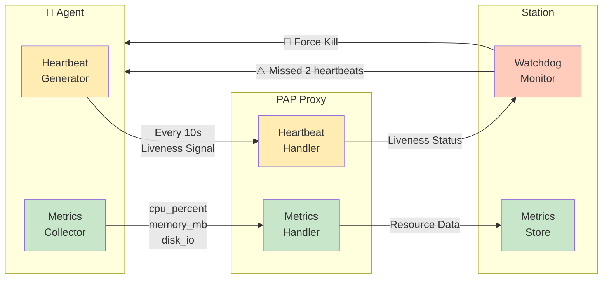

# PAP SDKs

This directory will host language-specific client and server SDKs that implement the PAP transport, authentication, telemetry helpers, and lifecycle primitives.

## Target Languages
1. **TypeScript** — Browser-friendly and Node runtimes; ideal for control plane integrations.
2. **Python** — Data and automation agents.
3. **Rust** — Systems-level agents and proxies.
4. **Go** — Infrastructure services and Station components.

## Shared Requirements

- Wrap signing and verification helpers for PAP envelopes.
- Provide heartbeat emitters with pluggable health probes.
- Offer retry-aware `invoke` helpers with deadline propagation.
- Surface structured errors mapped to PAP `ErrorCode`.
- Ship conformance tests that exercise handshake, invoke, event, and lifecycle flows.

## Key Design: Heartbeat vs Metrics Separation



**Rationale:** Heartbeats are lightweight liveness signals sent at consistent intervals. Resource metrics (CPU, memory, disk) are collected separately and can be sent at different frequencies or batched. This separation ensures zombie detection remains reliable even under high load.

## Directory Plan
```
sdk/
  typescript/      # Node/browser SDK
  python/          # Python package (pyproject + dataclasses)
  rust/            # Cargo crate
  go/              # Go module
  tests/           # Protocol compliance suites
```

Baseline scaffolding is in place. Each SDK SHOULD now add generated protobuf bindings and runnable examples mirroring the flows described in `docs/rfc/pap-rfc-001.md`.
